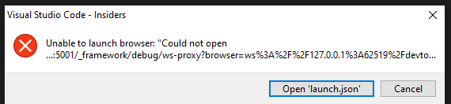

# Our first Blazor WebAssembly App

## Create a new project using the Blazor WebAssembly template

```csharp
dotnet new blazorwasm -o MyPOIs.Client --pwa
```

## Start the app

```csharp
dotnet run oder dotnet watch
```

## Look around in the app
* Menu
* Counter
* Abount
* Fetch Data


## Stop dotnet watch

* CTRL + C

* **Whooho!** The app is still running.


## Test the Debugger in Visual Studio Code

* Open folder ``` 10-Blazor-Initial ``` in Visual Studio Code
* Set a breakpoint in the Counter.razor file
* Start the debugger
* Create launch.json



* Add the following line to the launch.json
* "url" :"http://localhost:5143",
* To find the right port look into launchsettings.json
* "cwd": "${workspaceFolder}/MyPOIs.Client",
* "timeout": 30000

## Debug with only the Webbrowser
* SHIFT + ALT + D
* msedge --remote-debugging-port=9222 --user-data-dir="C:\Users\cwill\AppData\Local\Temp\blazor-edge-debug" --no-first-run http://localhost:5143/
* Change variable currentCount in Scope area
* 


